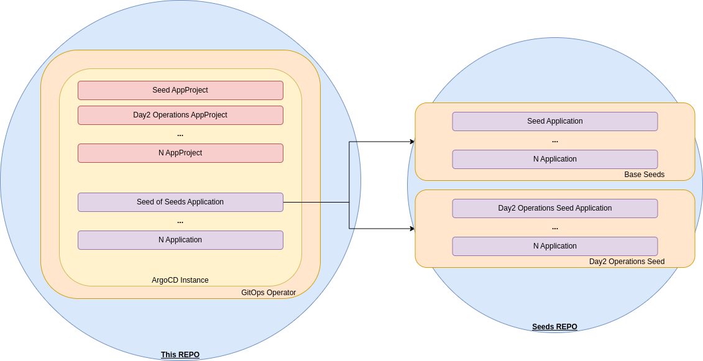

# Red Hat Openshift GitOps Operator

Deploy Red Hat Openshift GitOps Operator

A bootstrap script to deploy the Red Hat OpenShift GitOps operator with an ArgoCD instance, desired AppProjects and one or more initials Argo Applications to start the GitOps cluster population.

# TL;DR;

````bash
./bootstrap.sh
````

# Steps done by the script
- Red Hat OpenShift GitOps operator Subscription (at cluster level) with manual approval plan
- Find the installPlan pending of approval and approve it
- Delete the Default ArgoCD instance provided by the operator
- Deploy a desired new one ArgoCD instance
- Wait to have this new instance at a Running state
- Delete all the previous AppProject resources
- Deploy the desired AppProject resources
- Deploy the initial ArgoCD Application/s to populate all the cluster resources and configurations

# Seed process diagram



## License

This work is under [Creative Commons Attribution-ShareAlike 4.0 International License](http://creativecommons.org/licenses/by-sa/4.0/).

Please read the [LICENSE](LICENSE) file for more details.
